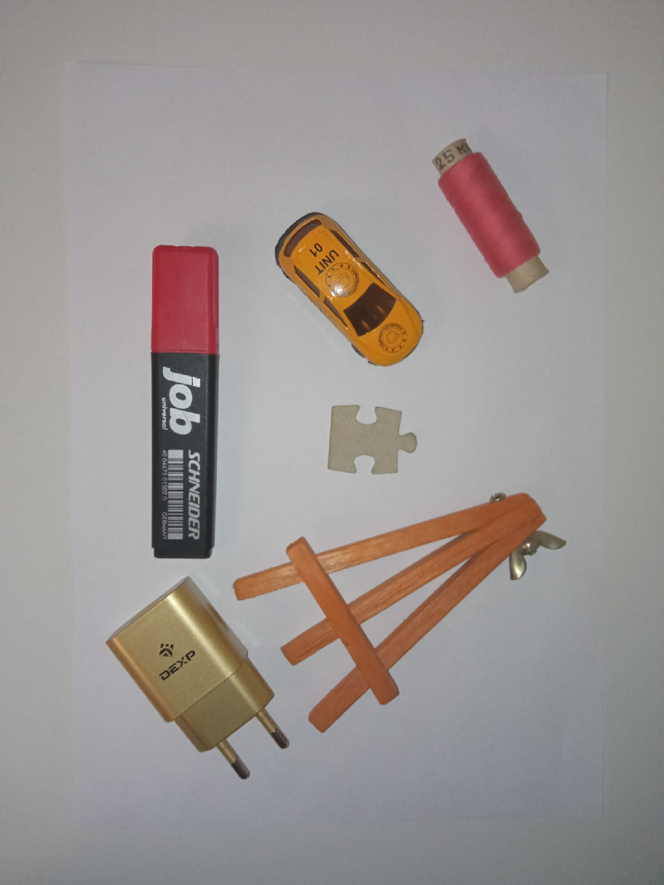
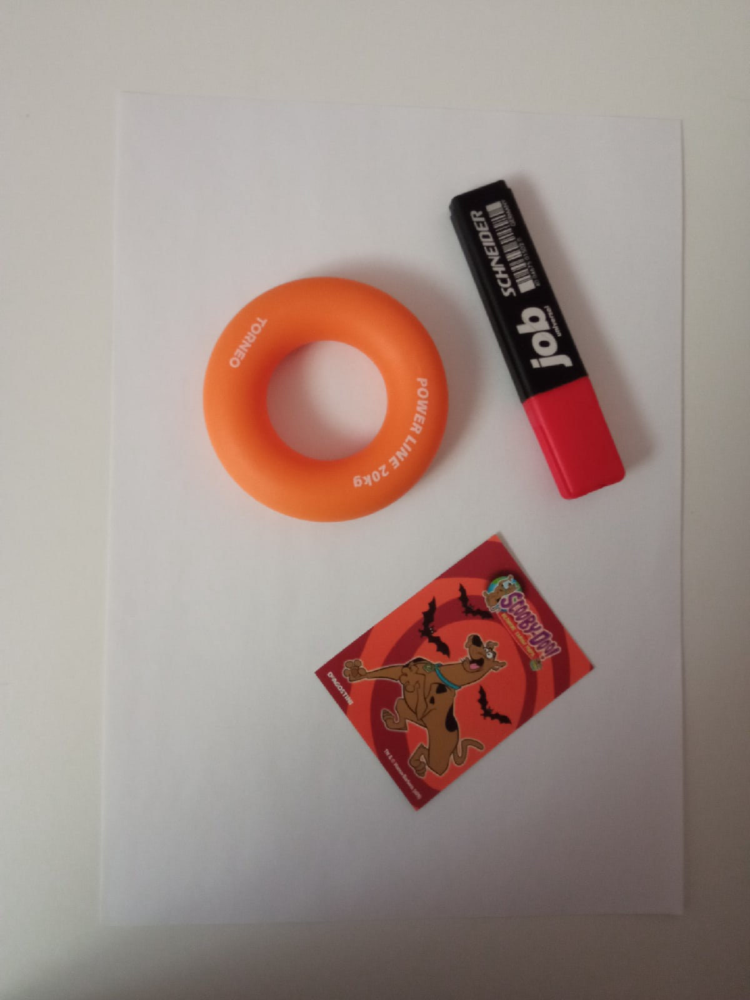
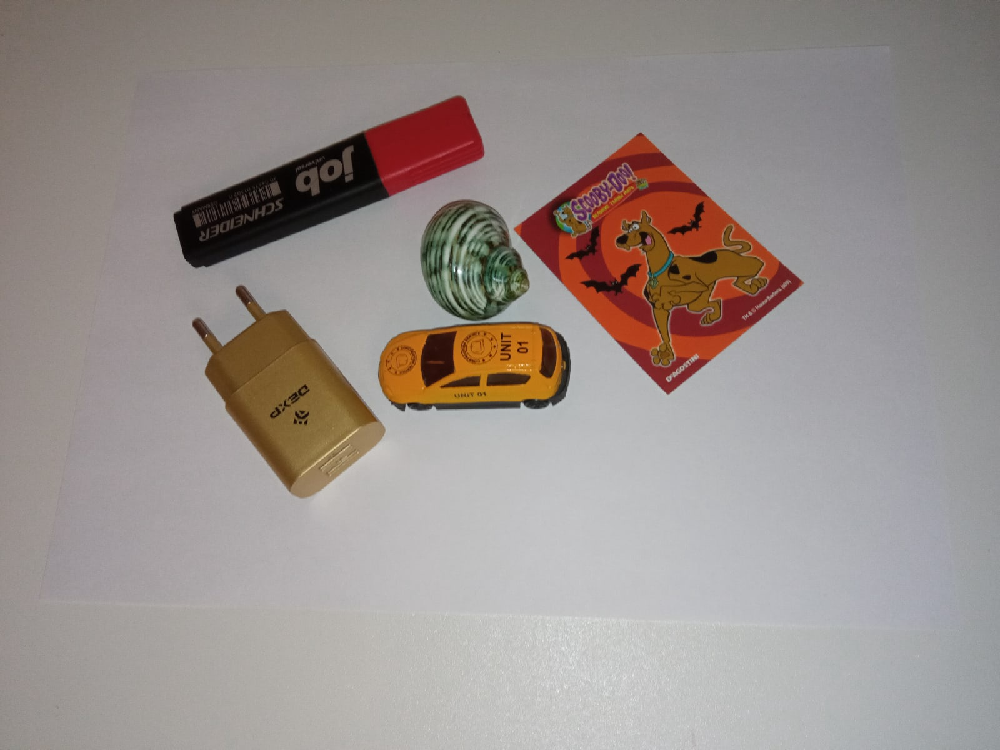
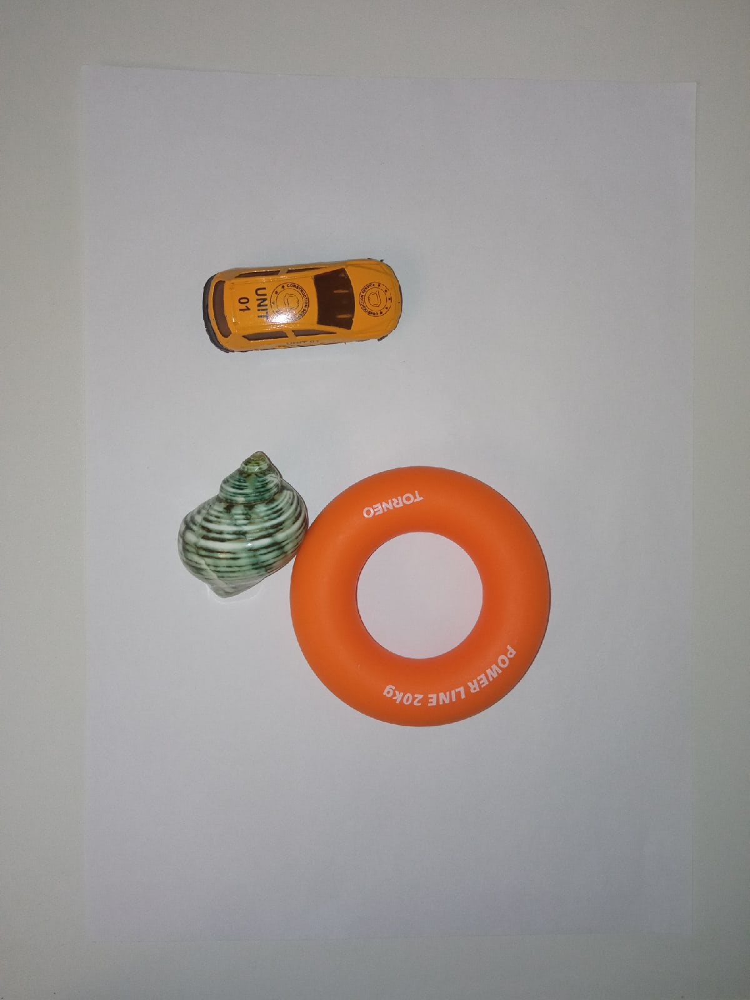
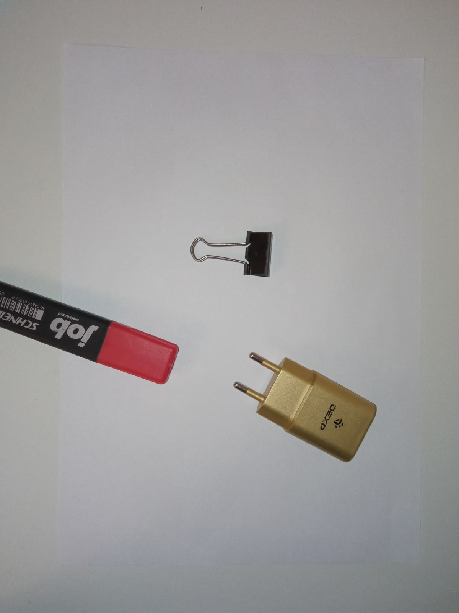

#Тестовые данные


Две корректных входных фотографии, на которых представлен весь набор предметов.
Ожидаемый результат: ```True``` или ```False```, в зависимости от ограничивающего прямоугольника.


Особенности: имеются слишком большие тени, а также освещение отличается от того, что присутствует на фотографиях набора предметов.
Ожидаемый результат: Ошибка работы алгоритма.


Особенности: угол наклона фотографии больше допустимого, присутствует иной ракурс предметов.
Ожидаемый результат: Ошибка работы алгоритма.


Особенности: предметы находятся слишком близко друг к другу.
Ожидаемый результат: Ошибка работы алгоритма.


Особенности: один из предметов выходит за границы кадра.
Ожидаемый результат: Ошибка работы алгоритма.


